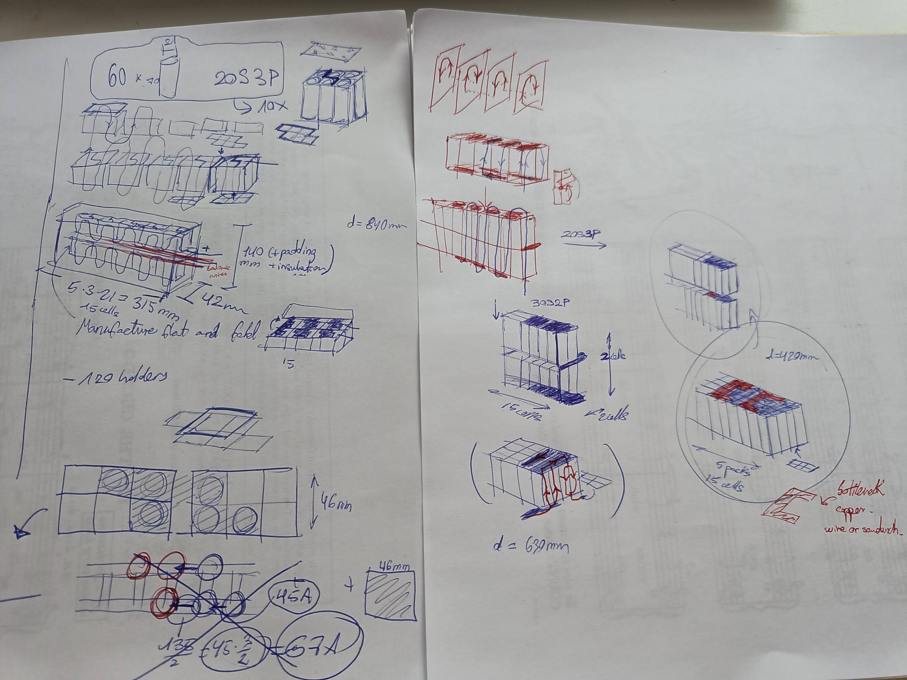
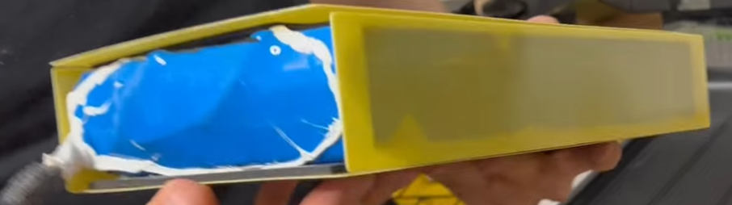
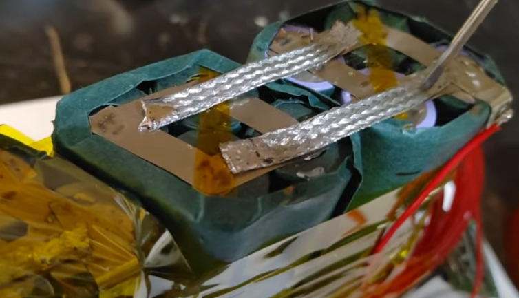

# Battery - Power and Charging

## CHARACTERISTICS

- ABSOLUTE LIMITS - **20S2P PACK** - Voltage, Current, Temperature
    - The firmware may put other limits depending on voltage, current, and temperature, but these are the limits that won't be exceeded under any condition.
    - **84V** (4.2V * 20), max voltage * series
    - **90A** battery flow (45A * 2), max cont discharge current * parallels (will be limited to a fraction. Charging max is 25A, so probably about 60A discharge)
    - Charge: **16.8A** (8.4A*2), **1.41kW**
    - Discharge: **90A, 7.56kW**
        - Probably limited to **60A, 5kW** for standard BMS

- CELL LIMITS - SAFETY HOLY GRAIL:
    - **Operating Temp: $0ºC$ to $45ºC$**
    - Max continuous charging current: $8.4A$ (-max torque -max speed)
    - MOLICEL INR-21700-P42A ($60=50;=5*3*2*2$)
        - [INR-21700-P42A_datasheet.pdf](../assets/datasheets/INR-21700-P42A_datasheet.pdf)
        - [Detailed datasheet](https://www.molicel.com/wp-content/uploads/INR21700P42A-V4-80092.pdf)
        - LiNiMnCoO2 (NMC) cathode
        - Impedance at 10A DC 1s: $10 m\Omega$
        - $15.5$Wh, $4.2$Ah, $2.5V - 3.6V - 4.2V, 16m\Omega$
        - Discharge:
            - Continuous: `30A`
            - Peak: `45A`
        - Charge (<8.4A, <4.2V):
            - Max continuous: `8.4A`, 2C $(\frac{8.4A}{4.2Ah} = 2h^{-1})$
    - **Max peak charging pulse**:
        - [INR-21700-P42A_power_pulse.pdf](../assets/datasheets/INR-21700-P42A_power_pulse.pdf)

## PACK
- Energy: $40 * 15.5Wh = 620Wh$
- Max continuous power discharge at 3.6V: $40 * 3.6V * 30A = 4320W \approx 6$CV
- Max charge power at 85%SOC, 40ºC: $40 * 4V * 4.2A = 672W$
- EUC Range: $672Wh / 32.5Wh/km = 20km$
    - Current efficiency: $32.5$Wh/km = $117$J/m = $3.25 \frac{kWh}{100km}$

## FIRE
- [FB4LF-500 encapsulator agent, 4L to 1.8kWh](https://youtu.be/NkH7TzFtSP0?si=DRWmJS_XxrlnIuxk)
- [EUC FIRE](https://youtu.be/Oa79go_aUfc)
- https://everythingelectricunicycle.com/electric-unicycle-fire-risk-and-possible-causes-solutions/
- Fire retardant casing (LithiumPrevent):
    - robnor resin to prevent fire.
- Seriously protect + - separation of cells
- Standards to meet:
    - UL94 V-0 for the minimum used material thickness
    - FAR 25.853(a)(1)(i)

## Battery construction diagram and assembly calculations

- 20S3P, **20S2P**, 30S2P
- Estimated lateral space left for the batteries = (Total Width without ankle padding - Wheel hole width - 4 * chassis_thickness - 2 * padding) / 2 = $(200 - 3*25.4 - 4*3 - 2 * 3)/2 = 52.9mm$, so `math.floor(52.9/21) = math.floor(2.52) = 2`. Two layers of stacked cells
- Dimensions of cell pack (20S2P): `10*23 x 2*23 x 2*70 = 230 x 46 x 140 mm`

- Small fans inside the pack

## Cell connection methods
- ~~Bus bars~~ (Hard to connect to the bus bar, hard to assemble)
- ~~Nickel Strip (Spot Welded)~~ (0.15x20mm just 20A, I need 135A)
- **Braided Copper Wire** soldered over Nickel strip
- ~~Busbar Connectors~~ (My cells are not compatible with them)
- **Copper Nickel Sandwich**
    - https://endless-sphere.com/sphere/threads/copper-nickel-sandwich-buses-for-series-connections.108006/
    - The nickel is the resistance that heats up, the current goes through the copper, heat accumulates at the contact points with the nickel, all metal melts, which allows the copper to also connect with the aluminum of the cell terminal below.
- ~~Copper Nickel busbar (tab sheet)~~ (About 150€)
    - Copper with small sections of nickel spot welded where each cell goes. I just have to cut it, place it, and spot-weld it like nickel strips, but with the higher current capacity.

## Braided Copper Wire

## Cell-level fuses? NO. 1 slow fuse per pack instead

- **All parallel packs have the same current. One fuse fuses all.**
- **A few cells in parallel = a big cell.**
- **Can't short one cell without shorting the others of the pack, so 1 fuse per pack is enough for shorts. However check temp and voltages for other failure modes**
- **These cells can provide 45A, which needs resistance as low as 70mOhm to flow. It's almost a short-circuit. As long as you have R 70mOhm you're within spec, and the power will dissipate outside the cell. If the resistance increases because of damage, I expect that to be gradual and detectable by the BMS to trigger emergency.**
- Fused nickel strip or fuse wire spot welded, about 22mOhm per fuse, calibrated to trip at about 50A?

## Discharge protection of BMS? NO. JUST MONITORING AND ALERTS
- Better let the battery soak up a slight overvoltage for some seconds rather than faceplant due to overvoltage protection after regen.
- Most cutouts are caused by the BMS. You can pull WAY more current than the datasheet allows if it's a short period of time, so don't go crazy cutting power and instead trigger an alarm to stop.
- Adds cost, weight, bottleneck, and complexity. Failure point
- Just monitor the battery and limit the use with the ESC. Protect charging and balance cells. By default ok values allow riding, any error limits or disables balancing (leanback, not cutout)

## Design objectives
- Layout with shorter series paths. Less resistance where the current flows.
    - For this, good layout and copper wires soldered to the nickel strips, then the strips spot welded to the cells.
- Balance between safety of rider (no cutouts) and safety of battery (no fires).
    - BMS with no capability to cut power, but huge safety margin of current, voltage, and temperature of cell limits. When exceeded, trigger alert/warning and force leanback or emergency stop. Fast pulses are not blocked, to prevent falls. The cells can withstand it for a short time. Emergency state must diverge behavior so it can't be rided permanently leaning back out of spec. Force leanback further and further until stop. Stop must happen.
- Assembly: Cells with rigid structure, then squishy stuff, then rigid structure (glass fiber board), then squishy stuff, then rigid container of EUC chassis, then squishy stuff outside of EUC chassis.
- Ports:
    - 230VAC type-f Schuko plug (compatible with Type N even better) like a vacuum cleaner. Usually charge with 110-240VAC 50-60Hz. The charger is built-in. Do not trust random ass external chargers.
    - Allow 12VDC. General range even better.
    - USB-C, with the max 240W (48V 5A). To power electronic devices.
        - I want always 5V by default for dumb devices + negotiation to get more if required. On-Off switch to turn off the 5V is ok.
    - XT90 Anti-spark battery access connector (through BMS)
- Be able to limit the charge to 90% or something. Integrated charge doctor. Cell balancing should still work.

## BMS
Smart, 20S 84V 135A?, charge-side mosfets, balancing, monitor, communications with VESC. More like a BMU with serious control over the VESC.

Even if the BMS is charge only, consider adding a mosfet/relay to open the battery contacts in case of emergency with VESC programming. After emergency state, if speed 0 or time passed, open contactor.

## Notes
Control the temperature by using heaters when cold and fans when hot. Insulate the heat sink in winter to waste less energy.

## References
- [MY REDDIT QUESTION](https://www.reddit.com/r/ElectricUnicycle/comments/161tk0n/bms_recommendation/)
- Search VESC BMS
- Brands
    - ~~[Tiny BMS](https://enepaq.com/product/battery-management-system-bms-30a/)~~ (Not enough voltage)
    - Ennoid (VESC compatible)
        - [Master-slave](https://www.ennoid.me/bms/gen-1)
        - [Single board, Full, 24S](https://www.ennoid.me/bms/ss)
        - [Single board, Charge only, 24S](https://www.ennoid.me/bms/xlite-v3)
    - [Orion](https://www.orionbms.com/products/orion-bms-standard) - $1000 + thermistors + current sensors
    - [MaxKGO](https://maxkgo.com/collections/bms-price/products/maxkgo-bms-4s-24s-15a-only-charge-bms-board)
    - https://www.lithiumbatterypcb.com/product/13s-16s-48v-or-60v-72v-20s-lithium-battery-bluetooth-smart-bms-54-6v-58-4v-67-2v-84v-electric-tricycle-pcb-with-200a-constant-discharge-current/
    - DongGuan Daly - 125A Charge - 250A Discharge
