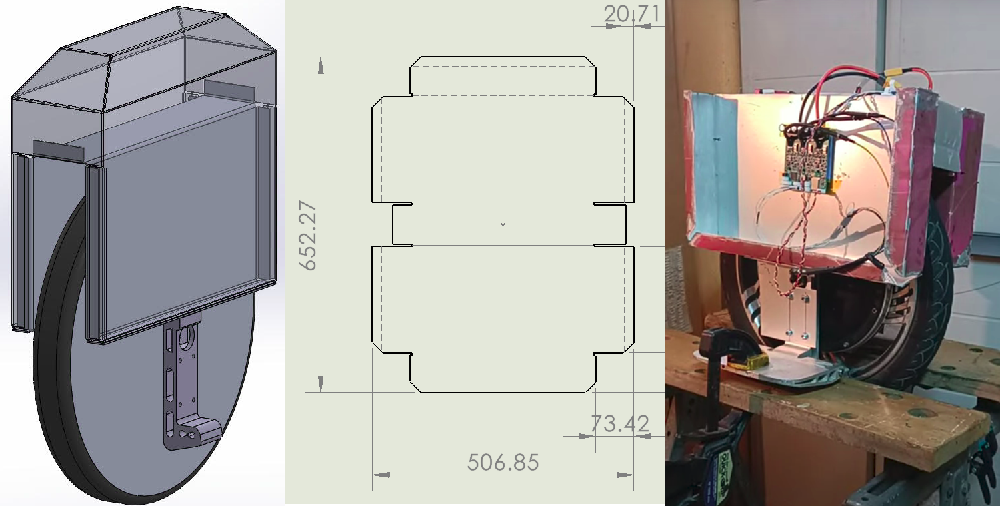

# Cyberwheel

## Purpose
Make electric unicycles that are reliable for everyday use: waterproof, impact-resistant, durable over time, and easy to repair.

For this, create an open-source community to design both the Hardware and Firmware, so they can be repaired and modified, free of proprietary restrictions.

[Video Pitch: https://youtu.be/mN5FoosNMC0](https://youtu.be/mN5FoosNMC0)

## Current state

TODO: Video. Waiting for laser-cut chassis to do new version and tune the PID.

## Why EUCs?
EUCs have a significantly bigger wheel than scooters (16 ~ 18"), which makes them more stable (yeah, It's hard to believe, but trust me), specially in rough terrain. They can go up curbs, down stairs, and sometimes even UP stairs. They're very pleasant to ride. Hands free, it feels like you're floating.

They're way easier to carry around, like a little suitcase, so you can use them to park your car in the outskirts of the city and ride the couple km left to your destination, skipping traffic and parking fees. For short trips, it might even replace your car. Current ones get easily to 90 km/h, and exceed 100 km of range.

## Goals
I want to challenge the idea that, if your EUC cuts out, it's your fault. A well designed EUC should never cut power, even if you try. There must be margin for error.

And this margin includes undervoltage AND overvoltage. Ideas to consider are resistor or motor coil short-circuit braking, instead of dumping to the battery when it's already full.

More on [requirements](./getting-started/requirements.md).

## What's the problem with current EUCs?
Even though current EUCs are very cool and powerful, they're generally not resistant to crashes, the hardware and software is propietary, they can often be damaged by simple rain, can overheat easily with no sensors to prevent it, and have battery fires.

I want to design an EUC that you can trust and repair yourself.

I plan to use a sealed enclosure for the electronics and batteries, increase the redundancy when possible, increase the margins for error, and design the EUC so it's impossible to conceive a cutout as anything but a fatal error.

## Features
- Sealed electronics and battery compartment
    > You can throw it in the sea and won't have to worry about it.
- Use the chassis as a heatsink. Probably an aluminum chassis, or an embedded heat sink.
- The handle will serve as a kickstand, and will unfold to serve as a metal arm that can be used to lock the EUC to a pole. It will also serve as a seat.
- It will have the charger built-in
- Consider self-leveling light that calculate the slope of the road based on the motor current draw and adjust the angle with a simple servo.
- Battery pack with fireproof cover
- Easy to assemble and disassemble

## Target parameters for now
About 50kmh, 80kg rider, hill climbing, 18" or 16", 20s 84V, no suspension, hollow bore motor preferrably
> I think C38 or C30 motors match. Best is C38 high torque
