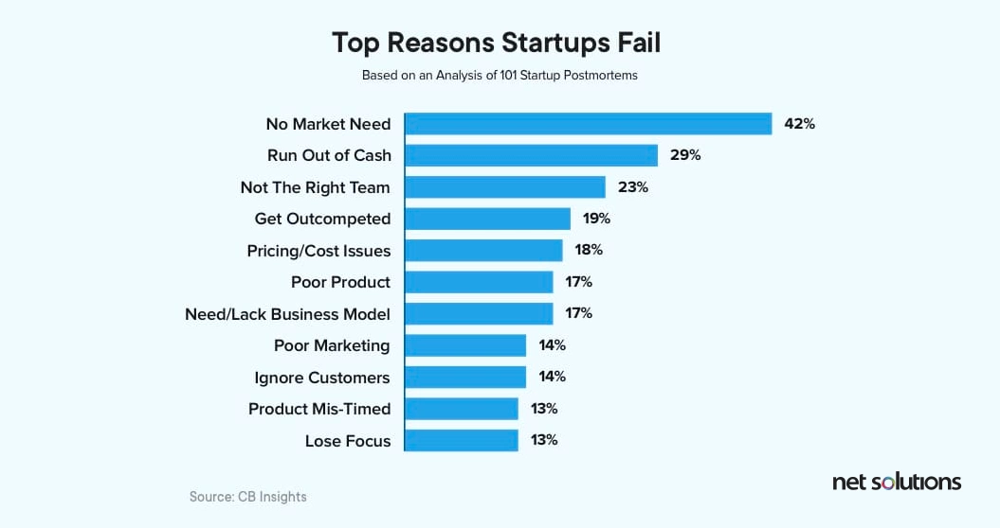

[readme](./README.md)

# Fix & Build - Hypotheses and MVP
## Modelo Frase
CREO QUE 
un monociclo eléctrico de código abierto, robusto y seguro,
  
PARA 
ofrecer una solución de movilidad personal confiable, resistente a fallas y fácil de reparar,

CLIENTES A LOS QUE TE DIRIGES
personas que buscan transporte alternativo, entusiastas de la tecnología abierta y usuarios preocupados por la seguridad y la durabilidad,

LOGRARÁ 
un medio de transporte más estable, sin cortes de alimentación inesperados, resistente al agua y con mejor disipación térmica,

RESULTADO DE LLEVAR A CABO LA IDEA
un monociclo eléctrico sostenible y fácilmente modificable, que reduzca la dependencia de soluciones propietarias y promueva la innovación colaborativa.

## Already tried?
No, hay en reddit gente preguntando y nadie les hace caso, luego hay un monociclo cyberwheel que era estéticamente como el cybertruck y poco más, no he visto mucha continuación.

## Notes
Define KPI's, a sucess threshold, and indicators for every aspect of the business.

Assumption about a thing + proposed solution + expected outcome = Hypothesis, which should be testable and verifiable.

## Questions -> Assumptions -> Hypotheses
1. How much money are clients willing to pay for a custom EUC? What do they want?

> Which one will impact the users the most? Prioritize.

- Bootstrapping:
    - No dejar trabajo
    - No comprar. Alquilar
    - No escalar sin necesidad
    - Centrar en cubrir gastos

> La mejor forma de validar una startup cuando empiezas es testear tu precio y confirmar que los clientes realmente están dispuestos a pagar por tu solución.
    - Cómo testear el precio sin el MVP? En mi caso creo que sí lo necesito. No el definitivo, pero sí una versión simple para testing, y para subir contenido que permita tener más contacto con posibles clientes, crear algún evento o quedada etc.

- Creación MVP
    - Define Propuesta de Valor
        - Documento en Mentoring, el Canvas
    - Elige la Audiendia Correcta
        - En el canvas también
    - Determina el tiempo de prueba
        - Unos 6 meses, el verano estaré desarrollando, para probar con personas a finales, septiembre aprox.
    - Testea la respuesta del público
        - Gente curiosa, gente excéptica. Todos querrán probar antes de pagar nada. Para eso la idea de eventos donde les enseñamos gratis y les alquilamos a precio de coste, o a precio que nos de un beneficio, con la opción de probarlo gratis o con descuento si antes ayudan a otras personas a montar. Así se auto-sostiene el evento. Creo que puede ser buen plan de quedada para amigos, como quien va a jugar al paintball o a hacer karts.
    - Modifica el producto o servicio (en base al feedback)

- Prototipo vs MVP:Zapier
    - Prototipo prueba conceptos, MVP es la prueba funcional básica.
    - Por ejemplo mi monociclo para testing es un prototipo, no es MVP porque no lo podría vender. Me sirve para validar otras cosas.
    - El MVP vendrá más adelante, donde un cliente lo pueda usar sin tener que saber programarlo, sin miedo a que se moje etc.
    - Sólo el MVP llega a responder si el usuario estaría dispuesto a pagar por el valor, y cómo ganamos dinero.

## Guide to MVP
1. Identify marketing approaches and platforms to get leads
2. Gain insights about the technical requirements

https://www.netsolutions.com/hub/minimum-viable-product/build/

- Features:
    1. Fully working EUC, closed and usable like a normal one
    2. Sensorization of the battery, motor etc.
    3. Document the process of building it, so the community creation starts gaining traction. Publish ideas online so people try them and I don't have to. Everything should be compatible with my EUC. Share them when they actually are compatible.
    4. Develop the technical testing plan, to validate the safety of the device under most situations. Basically this feature will be safety.
    5. Build the battery with fire-proof foam and compressed rubber
    6. Integrate the charger into the EUC

- Landing page
    - Naming: Nombre y Logo.
    - Copy: 
    - Call to Action (CTA): Oferta irrechazable. Beneficios y características.
        - Próximos eventos, cuándo y donde. Botón para compartir con amigos.
    - Hero shot: Video con la historia. (O en texto)
    - Social proof: Testimonios, reviews

- Recommended apps for MVP:
    - Wix
    - Launch Rocks
    - Wordpress
    - Weebly
    - Site123
    - Gofundme
    - Google AdWords
    - Facebook Business Manager
    - Stripe
    - Mailchimp
    - Team: Google Workspace + Notion

Cuando los clientes validan las hipótesis, se tiene el business case del MVP.

