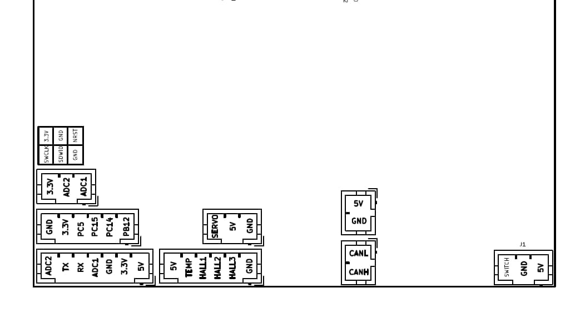

# Reasoning for main location of components -- General configuration
The **inside chassis** of the EUC must hold its own weight, and it won't be subject to crashes or sudden crashes, since the rubber and rim separates it from the ground, and the internal components from crashes around it.

Therefore, a strong and heat conductive material is ideal, not necessarily tough. The sides will be flat, probably with velcro to put pads in any way.

For prototypes with pedal hangers, it will go over them. Like this the geometry is much simpler, the weatherproofing is better, and the motor can be dissassembled much more easily. For large bearing motors, the chassis will be the pedal hanger.

To gain maximum crash resistance, squishy stuff on the outside + rigid stuff inside is ideal, since nothing will penetrate the EUC and the acceleration will be softened. The pads will act as bumpers.

The **outside shell** of the EUC must be optimized for crash resistance, not strength. This highly suggests using GFRP or similar (Fire resistant epoxy?). It should be thermally reflective outside, and insulating, so the battery doesn't get cooked by the sun.

The **Front** will have lights. Since it needs a transparent material with power inside, it's ideal for the antennas too.

At **Top-front** there will be a handle. The handle could be the hinge for a bigger lever that also serves as kickstand and lock. You open it and click it closed around a lamp post or something. Could be two stacked frames like _, that can rotate to form /\, a triangular truss. Rigid grabbing point and good lock to leave it in the street.

The top should be seat-shaped so this could create a conflict.

**Back-down** needs a mudguard. A place for license plate, other info like phone number, and lights.

**Back-up** is the best place for charging ports, since it's the most protected from rain, and unoccupied by other components.

Large in x direction, since we'd need mudguards anyway.

# Observations
- Vents to relieve pressure during fire, while preventing oxygen and water from entering.
- If 60 4Ah Li-Ion cells release all their energy to an 8kg aluminum chassis, it would heat to ~464ºC without melting (Al melts at 660ºC)
    - $\Delta T = \frac{E_{bat}}{m_{Al}*cp_{Al}} = \frac{60*3.7V*4Ah}{8000g*0.9J/gK} = \frac{888 Wh * 3600J/Wh}{7200J/K} = 444K$
- Cascading PIDs
    - use 2 pid loops. One controls the vehicle rotation speed (rate), the other vehicle attitude (angle). This is how many multirotoros (copters) fly, and this is probably the mode that will bring the most stability. It may feel very different in onewheel configuration, not sure if many people like it or not, but this mode can make unicycle pedals feel very hard. 
    - the main (rate loop) does not depend on IMU. It reads RAW gyro data. So less susceptible to IMU tuning, numerical errors, accelerometer noise and jitter.
    - Angle loop depends on IMU, but has much less input.

# Other preferences
- Big inclined pedals inspired by nylonove
- The lighting must be uniform (more light at horizontal angle, to cover more area with uniform brightness), with a servo that takes the angle from the IMU and keeps the lights pointing forwards. https://youtu.be/UxABxSADZ6U
- Wheel easy to remove, downwards, with part of the arm screwed. Disconnect the cables in an accessible place and pull them down.
- Handle + Locker + Kickstand + Mudguard all at once
- Don't screw into plastic.
- Field Oriented Control (FOC) instead of BrushLess DC. No noise more efficiency.
- Connectors
    - XT90S
    - Molex Pico-Clasp (small, locking, populate as many pins as you want)

# Consider in the future
- **If a resistor is added to dump energy instead of regen, the euc will work at temperatures of 60ºC instead of 45ºC (Look [MolicelP42A Datasheet](./datasheets/INR-21700-P42A_datasheet_detailed.PDF))**
- Company: Safe environment and create provoked cutoffs, learn to fall
- Built-in dashcam
- Utilizar la placa principal como cargador? No necesitar placa extra. Hay un coche eléctrico que lo hace.
- Imagine a wheel with an axial flux motor at each side, and a controller board for each motor, working in parallel. Redundancy. If one fails, the other continues working, and the wheel leans back to slow down to a safe speed.
- Recognize when there's no rider (EUC flying alone), and slow down until it stops, instead of just balancing.
- Reverse leanback for breaking
- Tiny wheels to prevent falls after cutoff of normal EUC?

For a redundant system, wheel with 2 hub motors in it, with 2 controllers and batteries, fully independent systems working in parallel. If one fails, the other continues. Even if it fails with short-circuit, motor fuse of the fail side blows (shortcircuit creates a lot of current), while the other compensates and continues.

- Redundant electrical system: computer and power supply, maybe even motor coils (two motor windings in one motor structure, temperature of one doesn't affect the other)
- Storage compartment with small door lock (key or software controlled), to store things in the EUC and leave it locked to a tree or streetlight.
- Hollow bearings?
- No-power mode: when there's no battery available (BMS failure, short, bad contact, etc), go into a mode where balance is done just braking. Power to resistors or the motor itself, no battery.
- Electrically isolated tab gallium nitride mosfet?
- Haptic notification through the pedals when overpower or overspeed.
- Design the shell as a side pad? I don't think so. Flat metal and add pads over it.
- Fingerprint on switch?
- Blinkers on the pedals with buttons over the wheel?
- IMPORTANT, LONG TERM: WHEEL WITH DUAL HUB MOTORS, COILS AT EACH SIDE, DUAL VESC WITH DUAL PROCESSOR, DUAL BATTERY. REDUNDANCY AND BETTER CUTOFF TOLERANCE. VERY RARELY EUC FAIL STUCK. THEY FAIL OFF.


---
# Appendix
- Acronyms
    - EUC: Electric UniCycle
    - SOC: State Of Charge
    - ESC: Electronic Speed Controller
    - VESC: Vedder Electronic Speed Controller
    - BMU: Battery Management Unit
    - BMS: Battery Management System, BMU + switch to disconnect battery
- Reference system: X forwards, Y left, Z up.
- Dimensions:
    - Small hexagon: 30x41(25)
    - Big hexagon: 520 width x 400 height x 300 upper side
    - 18mm of lip to screw and seal the lid is enough.
    - 13cm max width at knee height. (->120mm)
    - Normal 16S battery thickness (with bms and stock padding): ~24mm
    - 2 layers of 2170 cells hexagonally packed mesaure: $21mm*(1+\sqrt(3)) = 39.2mm$
    - Wheel space of 74mm -> comaptible with 2.75in tyres, about 70mm wide. I want ~60mm wide, between 2 and 2.5 inches.
    - EUC Width (Distance between legs): About 24cm with padding, 20cm the bare EUC.
        - 
    - Pedal height: about 6.5in = 165mm

- Cell Resistance $>100m\Omega$ -> it's bad.
- LFP voltage range: 3.2V nominal, 2.5-3.65V, 2.6-3.6V, 3-3.2V, 
- At the knee, max 13cm distance.

- To have bidirectional USBC charging: **LTC4160*- but the battery is 100V. It's not worth it to be able to charge the unicycle through the bidirectional USB-C PD
- King-Song S22 mosfet package: TO-247
- 4AWG butt connector (crimped)

- Good batteries (high charge rate)
    - **molicel p42a**
    - **Samsung 40t**
    - litech
    - Samsung inr40t

# Protection gear
- [Wrong way full guide](https://youtu.be/KuLZsmgloxY)
- Wristguard
    - 	**[Decathlon](https://www.decathlon.co.uk/p/fit-adult-inline-skating-wrist-guards/_/R-p-6032?mc=8495083)**
    - 	[Ennui](https://www.skatepro.com.pl/116-11108.htm?stockcode=920017)
    - 	[Gloves with wristguards](https://www.gyroriderz.com/products/gants-gyroriderz-avec-proteges-poignets-integres-2-0?lang=en)
- 	Full face downhill helmet (more visibility and lighter than motorcycle). Goggles with 2 layers of glass to prevent fogging, and removable glass.
- 	Downhill kneepads
- 	Mountaineering shoes
- 	Hand mirror

# 
- Iterar, validar, ágil
- El software pensaba basarlo en el proyecto VESC, que está disponible en GitHub, de código abierto, y se podrían hacer mejoras sin empezar desde cero, teniendo electrónica compatible.
- Luego hay cuestiones de seguridad relacionadas con la batería. Si se prioriza la seguridad de la batería, puede haber cortes de potencia que hagan peligrar al piloto, y viceversa
- Use the chassis for cooling. 8kg of aluminum with heatsink in wheel hub and giant wheel moving air. Tape the heatsink in winter if the temperature gets too low.
- use this fuse? Fuse (135A max peak, allow it for 60 seconds, 270A for 1S)
    - UL Class T fuse 300VAC 200A (High-current, fast acting)
- Tienda hacen baterias: https://es.wallapop.com/user/hgomezh-426221412

#
Batería mide 30x9x11, con una caja de esas dimensiones internas me cabe. Algo de margen y poco espumita.
Caja de vino de madera, milwaukee de plastico adaptada, tubo cuadrado pvc 120mm

# 2025-03-07
VESC en Ubuntu.


The latest stable VESC firmware (v5.02) is the recommended choice for your Little FOCer V3.1 ESC. Users have successfully run v5.02 on this model, whereas the beta (v5.03) is more experimental and may not be fully validated for all hardware revisions.

1. Connect Power (xt60) to vesc
2. USB-C
3. click auto-connect

Motor config
Then limits, current voltage, and important RPM to not damage vesc.

---
Next Level VESC board, noted here
https://tronicsystems.com/products/x12
# To finally remember the difference between isotype, logotype, isologo, imagotype...
iso = symbol
logo = text
type = meaningless thing to add when we need more roots to form the word

Just symbol: iso -> isotype
Just text: logo -> logotype
Symbol and text as single entity: iso + logo -> isologo (not isologotype)
Symbol + Text together: Just an image -> imagotype

# 2025-03-25
Using VESC 6.05 in smartphone app (commit e3d25e96)
PROBLEM! I can configure roll angle errors, but it just continues running with state: fault


- try sensorless, see the difference. maybe the hall sensors are bad?

# 
- Sensors:
    - Motor temperatures and voltages
        - 6 wires: +,-,temp,3halls
    - Mosfet and pcb temperatures and voltages
    - Chassis temp
    - Internal humidity or pressure (detect crashes?)
    - Measure grounding, isolation?


# Pseudocode for the state machine
def continuous_monitoring():
```python
if running:
    # BATTERY TEMP CHECKS
    if (T_bat_C < -40) or (T_bat_C > 60): # Discharge temp limits
        emergency("Battery temperature error") # Hard leanback to 0
    elif T_bat_C > 40:
        alert(T_bat_C, "Alert battery too hot") # Show alert, run fan, limit speed (to limit power for a given acceleration)
    elif T_bat_C < 5:
        alert(T_bat_C, "Alert battery too cold") # Show alert, run heater, limit speed
    
    # MOTOR TEMPERATURE CHECKS
    if (T_mot > ?):
        emergency("Motor temperature error")
    elif (T_mot > ?):
        alert(T_mot, "Alert motor too hot") # Show alert, limit speed
    
    # MOSFET TEMPETAURE CHECKS
    if (T_mos > ?):
        emergency("Mosfet temperature error")
    elif (T_mos > ?):
        alert(T_mos, "Alert mosfets too hot") # Show alert, limit speed
    
    # BATTERY VOLTAGE CHECKS (State Of Charge)
    if (V_bat > ?):
        emergency("Battery overvoltage")
    elif (V_bat > ?):
        alert(V_bat, "Alert battery overvoltage")
    
    # BATTERY CURRENT CHECKS
    if (I_bat > ?):
        emergency("Battery overcurrent")
    elif (I_bat > 135):
        alert(I_bat, "Alert battery overcurrent")
    
    # Alert limiting power when low voltage
    # Look at INR-21700-P42A_power_pulse.pdf to calculate V_bat and T_bat -> max_current -> max_torque -> max_speed
    if (V_bat < ? about 2.8)
        alert(V_bat, "Alert battery undervoltage")

    # TODO undervoltage protection when accelerating?
elif stopped:
    if (T_bat_C < -40) or (T_bat_C > 60): # Discharge temp limits
        emergency("Temperature error")
    elif charger_connected:
        if T_bat_C <= 0: # too low
            activate_heater_from_charger()
            alert("Too cold to charge. Heating battery...")
        elif T_bat_C > 40: # too high
            alert("Cannot charge, too hot. Max cell temp is 45ºC")
        else:
            ok # charge at 4.2A max, 4V 88% SOC()
    else: # charger not connected
        if T_bat_C <= 0:
            activate_heater_from_battery()
            alert("Too cold to run, heating battery...")
        else:
            ok # but activate alert to keep heating if close to 0ºC, up to about 10ºC?
```

# Tyre
I want a balanced offroad capable 18x3 tire (18 diam, 3 width), with a motor like the C30, 84V, in the range of 2500W

- Consider
    - Schinko 244, Kenda K262, CST C186 (all
    14-2,75)
    - **Kenda K262 14-2,75in rim**
        - Sherman and EXN, 80€, with 14-2.75 rim, 
    - **CST C186 14-2,75in rim**
        - 42€, enduro, trial, with tube, 1.96kg, Brand CST, Profile C186, with 14-2.75 rim, 
    - **Heidenau K66 80/90-14**, 80mmx72mm-14in
        - 62€
    - Michelin City Pro 80/90-14 46P
        - 32€

# stuff
- [High Voltage Inter Lock](https://youtu.be/BC1zCC7CeX8)

- V13 parts:
    - Raptor controller
    - Potted battery
    - Redundant Hall sensors

# data about 16s batteries i have for testing
16s, assume 1.5Ah each, 1.5Ah battery
wheel diam 14in, 350mm


# ideal motor for little focer
i want high torque, not high speed, 20s 84V,

# 2025-10-07 - Refloat Configuration Troubleshooting (VESC 6.05, Little FOCer V3.1)

## Problem
After installing Refloat package and running motor + IMU calibration, the EUC would not balance. Motor would spin in manual mode, but balance app wouldn't engage.

## Symptoms
- RT Data (main VESC): No faults (FAULT_CODE_NONE)
- Refloat APPUI: State showed "Ready" but wouldn't transition to balancing
- Requested current: always 0A (-.--A)
- Filtered current: changed slightly when tilted
- IMU: Working correctly, detecting inclination
- Motor: Worked in manual control mode

## What We Tried (and didn't work)

### 1. SimpleStart Configuration
- **Location:** Refloat Cfg → Startup → SimpleStart
- **Action:** Enabled SimpleStart (should bypass sensor requirements for EUC without footpads)
- **Result:** No change - still showed "Ready" but didn't balance
- **Why it didn't work:** SimpleStart alone isn't enough - other settings block engagement

### 2. Startup Pitch Tolerance
- **Location:** Refloat Cfg → Startup → Startup Pitch Tolerance
- **Action:** Tried increasing tolerance to ±10° or ±15°
- **Result:** No change
- **Why:** Not the issue - IMU was reading correctly

### 3. Startup Click Current
- **Location:** Refloat Cfg → Startup → Startup Click Current
- **Action:** Increased to 3-5A for motor engagement pulse
- **Result:** No effect
- **Why:** Not the root cause - motor wasn't even trying to engage

### 4. Roll Angle Fault
- **Previous issue from 2025-03-25:** Had roll angle errors causing fault state
- **This time:** No faults showing, so not the same issue
- **Note:** For EUC (not onewheel), roll faults might trigger incorrectly - consider disabling

### 5. App Configuration Investigation
- **Confusion:** Initially looked at App Cfg → ADC (wrong place!)
  - ADC app is for throttle control (e-bike, RC car) - NOT for balance
  - Keep "App to Use" = "No App" for now (will need to change to "Balance" later)
- **Also checked:**
  - PAS (Pedal Assist System) - irrelevant for EUC
  - PPM, UART options - not needed for balance

## Key Findings

### The Missing Piece: Safe Start Setting
- **Location:** Refloat Cfg → Startup → Safe Start
- **Was set to:** "Regular" (waiting for footpad sensor engagement)
- **Should be:** "Disabled" (for EUC without footpad sensors)
- **Action taken:** Set to "Disabled" and wrote configuration
- **Result:** STILL DIDN'T WORK (as of writing this)

### Understanding the App Selection
- **Important discovery:** VESC needs an "App" selected to run autonomous control
- **App Cfg → General → "App to Use"** must be set to **"Balance"** for Refloat to work
- Manual mode bypasses app selection (for motor testing only)
- Current setting: "No App" - explains why it won't balance!
- **Options available:**
  - No App (current - only manual control works)
  - PPM (RC receiver input)
  - ADC (analog throttle)
  - UART (serial communication)
  - Balance ← **NEED THIS ONE**
  - PPM and UART

## Configuration That Should Work (untested as of writing)
1. ✓ Motor calibration done
2. ✓ IMU calibration done
3. ✓ Refloat package installed
4. ✓ SimpleStart enabled (Refloat Cfg → Startup)
5. ✓ Safe Start = Disabled (Refloat Cfg → Startup)
6. ⚠️ App to Use = "Balance" (App Cfg → General) - **LIKELY THE FIX**
7. Write motor configuration
8. Test

## Important Lessons Learned

### 1. Refloat vs Balance vs App Settings
- **Refloat** = Package that enhances/replaces the Balance app
- **Balance** = The VESC application mode for self-balancing
- **App to Use** = Must be set to "Balance" for Refloat to actually run
- These are separate settings that all need to be configured correctly

### 2. ADC Confusion
- **Refloat ADC inputs** (for footpad sensors) ≠ **App Cfg → ADC** (for throttle control)
- Don't touch App Cfg → ADC - keep it "Off"
- Refloat has its own ADC/switch settings in Refloat Cfg

### 3. SimpleStart is Not Enough
- Enabling SimpleStart doesn't automatically bypass all safety checks
- Also need:
  - Safe Start = Disabled
  - Probably other switch/sensor settings
  - App to Use = Balance

### 4. RT Data Navigation
- **Main RT Data** (VESC): Shows motor/electrical data (voltage, current, RPM, faults)
- **Refloat APPUI** (Refloat Cfg → APPUI): Shows balance-specific data (State, Pitch, Roll, etc.)
- Need to use Refloat APPUI for balance troubleshooting

## Previous Issue Reference (2025-03-25)
- Using VESC 6.05 in smartphone app (commit e3d25e96)
- Problem: Could configure roll angle errors, but continued running with state: fault
- Resolution: Not documented (need to note solution if this happens again)

## USB Driver Notes (related troubleshooting)
- Little FOCer V3.1 uses Silicon Labs CP2102 USB-to-UART chip
- macOS needs CP210x VCP driver installed
- Download from: https://www.silabs.com/developers/usb-to-uart-bridge-vcp-drivers
- After install + reboot: `/dev/tty.SLAB_USBtoUART` appears
- **Why custom driver needed?**
  - CP2102 doesn't use USB CDC (Communications Device Class) standard
  - USB is universal physically, but each chip needs translation driver
  - CDC-compatible chips work without custom drivers, but CP2102 predates widespread CDC adoption
  - Tradeoff: Better performance/reliability vs one-time driver install

## THE SOLUTION ✓
**Setting App to Use = "Balance" worked on first try!**

After changing App Cfg → General → "App to Use" from "No App" to "Balance" and writing configuration, the EUC immediately started balancing.

### Issue After Fix: Oscillation at ~5Hz
- **Symptom:** EUC balances but oscillates/wobbles at approximately 5Hz
- **Cause:** PID tuning not optimized for this motor/wheel combination
- **Solution needed:** Tune PID parameters in Refloat Cfg

## Normal PID Values for EUC (Refloat)
**NOTE:** These values assume standard Refloat scaling (0-10 typical range). Your version might use different scaling (0-100 or 0-1000). Check what scale your settings use!

### Expected Starting Values (Standard Scaling):
- **P (Proportional):** 2.0 - 3.0
  - Range: 1.5 - 4.0
  - Effect: Response speed. Too high = oscillation, too low = sluggish/won't balance

- **I (Integral):** 0.03 - 0.05
  - Range: 0.02 - 0.08
  - Effect: Corrects steady-state error. Too high = slow oscillation, too low = drift

- **D (Derivative):** 0.05 - 0.10 (for more rigidity, can go to 0.15-0.20)
  - Range: 0.01 - 0.20
  - Effect: Dampens oscillations AND adds rigidity. Too high = jittery, too low = overshoots/oscillates

### Current Setup (2025-10-07):
- **D set to ~20** - Either:
  - Version uses different scaling (20 might equal 0.2 in standard scaling), OR
  - Value is extremely high (needs verification next session)
- **To test next session:** Try standard values above and see if behavior changes
- Document actual P, I, D values being used and their effects

### For 5Hz Oscillation Fix:
- **Primary fix:** Adjust P and D gains
- **Secondary option:** Add filtering/lower filter frequency
- Adjust in small increments (10-20% at a time)
- Test after each change

### Tuning Process:
1. Start with P: Reduce until oscillation stops, then increase until barely starts again
2. Add D: Increase to dampen remaining oscillation
3. Fine-tune I: Adjust for steady-state position holding
4. Iterate

## Next Steps (when resuming)
1. ~~Confirm App to Use = "Balance" in App Cfg → General~~ ✓ DONE - WORKED!
2. Tune PID values to eliminate 5Hz oscillation
3. Document final PID values that work for this setup

## Firmware & Hardware
- VESC Firmware: 6.05
- Controller: Little FOCer V3.1 (84V 20S capable)
- Package: Refloat (latest version as of Oct 2025)
- Motor: [Add motor model if known]
- Battery: 16S test pack (1.5Ah cells, ~60V nominal)

